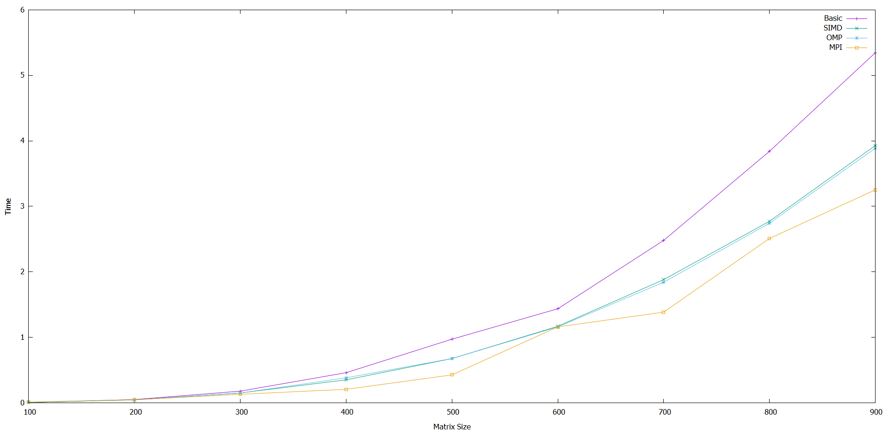

# Parallel Computing Lab
## Project Board
https://trello.com/b/lAjpyFbi/lab6

## Testing
The cycle was the same :

-Write code

-Compile code

-Run code 

-Test Code 

What was different on this project was that we had to run the project on the wolfgang cluster instead of our own machines which made it a little more tedious ,but nevertheless
after you get used to it the proccess is the same .
On this project focus was in measuring the speed for 4 different types of parallelization so we were able to do that by simple adding time variable to measure how long
each type took to do multiplication of a matrix with size n(where n was bigger than 100 and less than 1000).
Also we wrote code to generate different sizes of matrices this wasy everything would be automated.

## Requirments

### Research Question:  what is SIMD, OMP, and MPI? What are the differences between them?

1. MPI stands for Message Passing Interface . These are available as API(Application programming interface) or in library form  for C,C++ and FORTRAN.    
  Different  MPI's API are available in market i.e OpenMPI,MPICH,HP-MPI.Intel MPI, etc. Whereas many are freely available like OpenMPI, MPICH etc , other like Intel  MPI comes with license i.e you need to pay for it  .
    One can use any one  of above to parallelize  programs . MPI standards maintain that all of these APIs provided by different vendors or groups follow similar standards, so all   functions or subroutines in all different MPI API follow similar functionality as well arguments.
    The difference lies in implementation that can make some MPIs API to be more efficient than other.  Many commercial CFD-Packages gives user option to select between different MPI API. However HP-MPI as well Intel MPIs are considered to be more efficient in performance.
      When MPI was developed, it was aimed at distributed memory system but now focus is both on distributed as well shared memory system.    However it does not mean that with MPI , one cannot run program on shared memory system,  it just  that earlier, we could    not take advantage of shared memory but now we can with latest MPI 3

2.  MP stand for Open Multiprocessing . OpenMP is basically an add on in compiler. It is available in gcc (gnu compiler) , Intel compiler and with other compilers.
      MP target shared memory systems i.e where processor shared the main memory.
      MP is based on thread approach . It launches a single process which in turn can create n number of thread as desired.  It is based on what is called "fork and join method" i.e depending on particular task it can launch desired number of thread as directed by user.  

3. SIMD Single instruction, multiple data (SIMD) is a class of parallel computers in Flynn's taxonomy. It describes computers with multiple processing elements that 
      perform the same operation on multiple data points simultaneously. Such machines exploit data level parallelism, but not concurrency: there are simultaneous (parallel)
      computations, but only a single process (instruction) at a given moment. SIMD is particularly applicable to common tasks such as adjusting the contrast in a digital image 
      or adjusting the volume of digital audio. Most modern CPU designs include SIMD instructions to improve the performance of multimedia use. SIMD is not to be confused with SIMT,
      which utilizes threads.

| MPI           | OMP           | SIMD |
| ------------- | ------------- | ------------- |
|1 . Available from different vendor and can be compiled in desired platform with desired compiler. One can use any of MPI API i.e MPICH, OpenMPI or other  | OMP are hooked with compiler so with gnu compiler and with Intel compiler one have specific implementation. User is at liberty with changing compiler but not with openmp implementation.| 
| 2. MPI support C,C++ and FORTRAN | 2.OMP support C,C++ and FORTRAN |2.SIMD support C,C++ and FORTRAN |
|3. OpenMPI one of  API for MPI is providing provisional support for Java | 3.Few projects try to replicate OMP for Java. |3.SIMD support java as well.|
|4. MPI target both distributed as well shared memory system| 4.OMP target only shared memory system | 4.Each processor has its own memory.|
| 5.Based on both process and thread based approach .(Earlier it was mainly process based parallelism but now with MPI 2 and 3 thread based parallelism is there too. Usually a process can contain more than 1 thread and call MPI subroutine as desired | 5.Only thread based parallelism. |5.A single "control processor" issues each instruction, in turn, every processor executes the same instruction on its local data at the same time.|
|6. Overhead for creating process is one time| 6. Depending on implementation threads can be created and joined for particular task which add overhead|6.Overhead happens during conversion and rearrangement| 
| 7.There are overheads associated with transferring message from one process to another | 7.No such overheads, as thread can share variables |
| 8. Process in MPI  has private variable only, no shared variable |8.  In OMP , threads have both private as well shared variable |8.Some processors may be turned off on any instruction. This allows certain logical operations to be performed.|
|9.Data racing is not there if not using any thread in process .  | 9. Data racing is inherent in OMP model |
| 10.Compilation of MPI program require:1. Adding header file : #include "mpi.h" 2. compiler as:(in linux )  mpic++  mpi.cxx -o mpiExe | 10. Need to add  omp.h and then can directly compile code with -fopenmp in Linux environment  g++ -fopenmp openmp.cxx -o openmpExe |
| 11.Message Based | 11.Directive based |
| 12.Flexible and Expressive | 12.Easier to program and debug |12.Main advantage of these machines is the ease of programming. The disadvantage is that they are specialized machines and not suited to all applications.|
| 13.On distributed networks | 13.On Multi-core processors|13.Large number of small or simple processors.|
